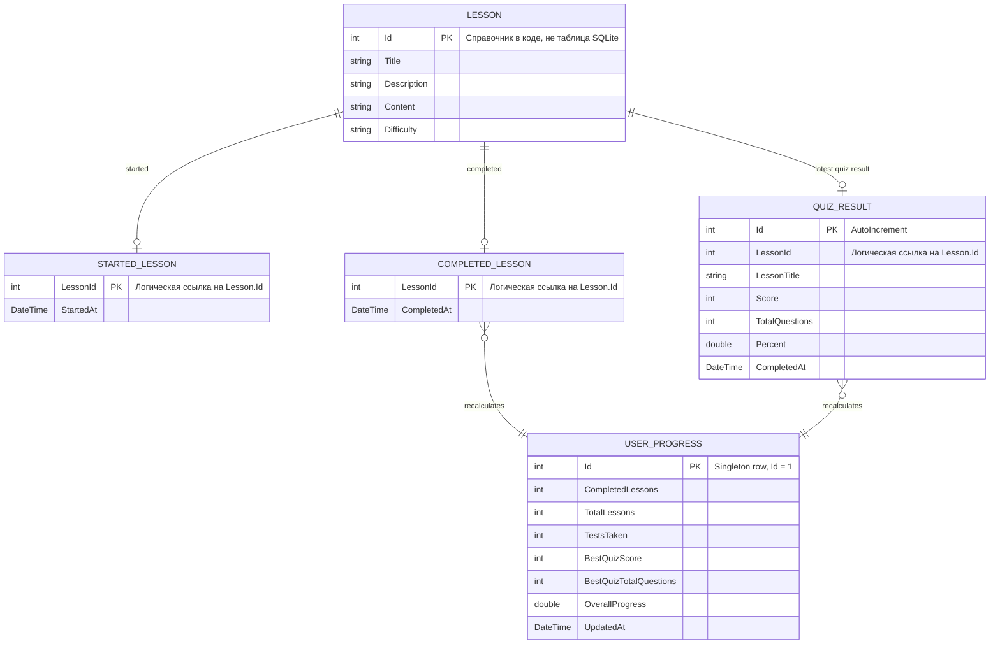

# ER-диаграмма базы данных

База приложения хранится в локальном SQLite-файле `learn_csharp_app.db3`.
Таблицы создаются в `Services/DatabaseService.cs` через `sqlite-net-pcl`.

## Фактические таблицы SQLite

В SQLite создаются только эти таблицы:

- `StartedLesson`
- `CompletedLesson`
- `QuizResult`
- `UserProgress`

`Lesson`, `QuizQuestion`, `QuizAnswerOption` и `LessonProgress` не создаются как таблицы базы данных. Они используются как модели данных в коде: уроки и вопросы тестов описаны статически в сервисах, а `LessonProgress` собирается на лету для отображения прогресса.

## Важные замечания

- В моделях нет атрибутов внешних ключей, поэтому связи с `Lesson.Id` являются логическими, а не ограничениями SQLite.
- Для `QuizResult` сервис перед вставкой удаляет старый результат по `LessonId`, поэтому фактически хранится последний результат теста для урока.
- `UserProgress` является агрегированной строкой с `Id = 1` и пересчитывается из завершённых уроков и результатов тестов.
