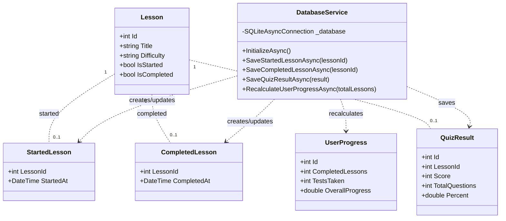

# Краткая UML-диаграмма

```mermaid
classDiagram
    class DatabaseService {
        -SQLiteAsyncConnection _database
        +InitializeAsync()
        +SaveStartedLessonAsync(lessonId)
        +SaveCompletedLessonAsync(lessonId)
        +SaveQuizResultAsync(result)
        +RecalculateUserProgressAsync(totalLessons)
    }

    class Lesson {
        +int Id
        +string Title
        +string Difficulty
        +bool IsStarted
        +bool IsCompleted
    }

    class StartedLesson {
        +int LessonId
        +DateTime StartedAt
    }

    class CompletedLesson {
        +int LessonId
        +DateTime CompletedAt
    }

    class QuizResult {
        +int Id
        +int LessonId
        +int Score
        +int TotalQuestions
        +double Percent
    }

    class UserProgress {
        +int Id
        +int CompletedLessons
        +int TestsTaken
        +double OverallProgress
    }

    DatabaseService ..> StartedLesson : creates/updates
    DatabaseService ..> CompletedLesson : creates/updates
    DatabaseService ..> QuizResult : saves
    DatabaseService ..> UserProgress : recalculates

    Lesson "1" .. "0..1" StartedLesson : started
    Lesson "1" .. "0..1" CompletedLesson : completed
    Lesson "1" .. "0..1" QuizResult : quiz result
```

Диаграмма показывает основные модели, которые участвуют в хранении прогресса пользователя, и сервис, который управляет SQLite-базой.
